# Rappel sur le modèle objet que nous utiliserons.

## Le modèle simple
Pour la partie objet, nous allons travailler sur ce modèle objet destiné à gérer une notion de
*série télévisée*. Ce modèle se veut didactique, il n'est donc pas exhaustif pour ce type de gestion
mais couvre tout ce qui sera abordé pendant la formation.


Ce diagramme ne décrit cependant pas les constructeurs. Ceux-ci doivent être :
```python
TvShow(name:str)
Episode(title:str, season_number:int, number:int, duration:int=None, year:int=None)
```
Notez que l'ordre des attributs et l'ordre des paramètres du constructeur peuvent n'avoir aucun
rapport entre eux.

## Utiliser le modèle
Pour alimenter ce modèle avec des données, vous disposez d'une fonction
`pyflix.datasource.load_show(name=None)` dans la bibliothèque `pyschoollib`. Vous pouvez l'utiliser
de la manière suivante :

```python
import pyflix.datasource as ds

for episode_data in ds.load_show():
    pass
```

La donnée `episode_data` est un N-uplet contenant :
 - le nom de la série
 - le titre de l'épisode
 - le numéro de la saison de l'épisode
 - le numéro de l'épisode
 - la durée de l'épisode
 - l'année de diffusion de l'épisode

Vous pouvez fournir un argument à `name` qui doit être un nom de série et donc filtrer sur cette
série. Vous pouvez obtenir la liste des séries connues par `pyflix.datasource.get_shows_names()`.

## Un pipeline
Dans le code à votre disposition, vous avez un scripte qui exploite les différents composants
abordés afin de charger les données d'un CSV pour alimenter les objets de connexion aux bases de
données SQLite. Vous pouvez l'exécuter avec :

```python
python -m demos.pyflix
```

Vous pouvez modifier le module `demos.pyflix.load_and_display` pour utiliser votre implémentation
de la *médiathèque*… si vous avez bien respecté les specs.

## Un modèle plus complet
Le modèle suivant ajoute la classe `Playlist`.

```mermaid
classDiagram
    direction LR
    class TvShow{
        +name : str
        +episodes : Episode[*] 
        +add_episode(title, season_number, number, duration, year)
    }
    class Episode{
        +title : str
        +number : int
        +season_number : int
        +duration=None : int
        +year=None : int
    }
    class Playlist{
        +name : str
        +episodes : Episode[*] 
        +add_episode(Episode episode)
        +watch_next_episode()
    }
    TvShow "1" --> "*" Episode : "Contient"
    Playlist "1" --> "*" Episode
```


Le constructeur de `Playlist` est similaire à celui de `TvShow`. La méthode `add_episode()` accepte un objet de type `Episode` car il doit provenir d'un `TvShow`.
