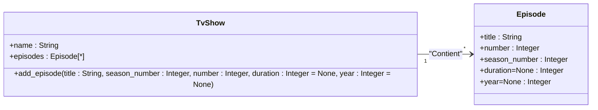

# Rappel sur le modèle objet que nous utiliserons.

## Le modèle simple
Pour la partie objet, nous allons travailler sur ce modèle objet destiné à gérer une notion de
*série télévisée*. Ce modèle se veut didactique, il n'est donc pas exhaustif pour ce type de gestion
mais couvre tout ce qui sera abordé pendant la formation.



Ce diagramme ne décrit cependant pas les constructeurs. Ceux-ci doivent être :
```python
TvShow(name:str)
Episode(title:str, season_number:int, number:int, duration:int=None, year:int=None)
```
Notez que l'ordre des attributs dans le diagramme et l'ordre des paramètres du constructeur peuvent 
n'avoir aucun rapport entre eux.

Une implémentation est présente dans le fichier `exos/pyflix/mediatheque`. Mais elle est incomplète.

## Exercice

Vous allez compléter la classe `TvShow`. Pour cela :

 * Ajoutez l'initialiseur comme décrit ci-dessus.
 * Ajoutez la méthode `add_epiosode()` selon la déscription du diagramme. Celle-ci doit ajouter un 
   épisode à la liste de l'attribut `episodes`.

Essayez d'avoir une approche dirigée par les tests
