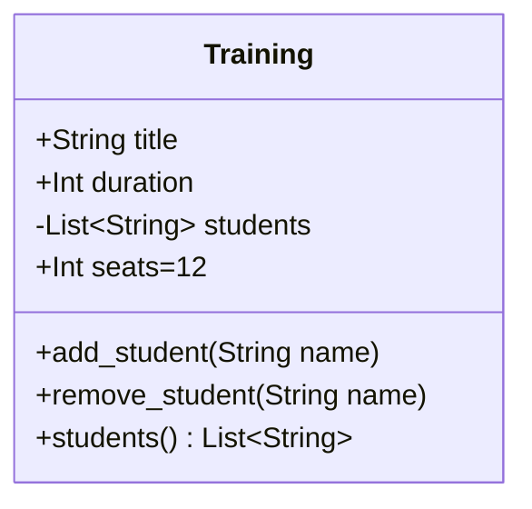
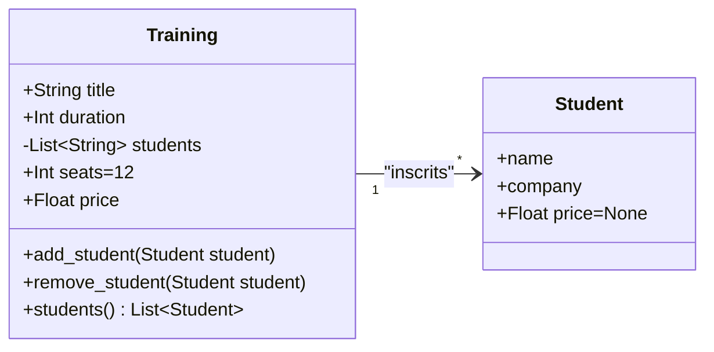

# La Programmation Orientée Objet

## Exemple de représentation.
### Représentation d'une classe


 * `Training` est le nom de la classe.
 * `title`, `duration`, `students` et `seats` sont des attributs.
 * `add_student(name)`, `remove_student(name)` et `students()` sont des méthodes.

### Représentation d'une relation

Note : au moment de la rédaction de cette page, le rendu de la cardinalité n'apparait pas. La 
relation est qu'un étudiant suit 1 formation, une formation est suivie par n (*) étudiants.

Un étudiant ne suit qu'une formation dans ce modèle car il y a une information de prix dans 
l'objet, prix qui ne concerne que cette relation.


## Déclarer une classe et instancier un objet
### Déclaration
```python
class MyClass:
    pass
```
### Instancier un objet
```python
>>> my_object = MyClass()
```
## Les méthodes
### Déclaration
Déclarer dans la classe une méthode avec comme premier paramètre `self`.
```python
class MyClass:
    def my_method_without_param(self):
        pass
        
    def my_method_with_param(self, param_1:int):
        pass
```

### appels
```python
>>> my_object = MyClass()
>>> my_object.my_method_without_param()
>>> my_object.my_method_with_param(42)
```

## Les attributs
### Affecter et accéder à une valeur dans l'objet
Un attribut dans la classe a un syntaxe `self.nom_attribut`.

On affecte une valeur à un attribut en déclarant celui-ci préfixé par `self` :
```python
class MyClass:
    def assign_value(self, value:int):
        self.attribute = value
```
On y accède en le référant de la même manière.
```python
class MyClass:
    def access_value(self) -> int:
        return self.attribute
```

### Accéder à un attribut en dehors de l'objet
On peut accéder à un attribut en dehors de l'objet
```python
>>> my_object = MyClass()
>>> my_object.assign_value(42)
>>> my_object.value
42
```

On peut modifier la valeur par assignation avec la même syntaxe. Note que si l'attribut n'existe pas, il est créé.
```python
>>> my_object = MyClass()
>>> my_object.value = 42
>>> my_object.value
42
```

---
## Les méthodes spéciales
Documentation : https://docs.python.org/3/reference/datamodel.html
### L'initialiseur
```python
class MyClass:
    def __init__(self, param_1, param_2):
        self.attribute_1 = param_1
        self.attribute_2 = param_2
```

### La représentation sous forme de chaine de caractères
#### Représentation informelle avec `__str__`
```python
class MyClass:
    def __init__(self, param_1, param_2):
        self.attribute_1 = param_1
        self.attribute_2 = param_2
        
	def __str__(self):
	    return f'Objet {self.attribute_1} {self.attribute_2}'
```

#### Représentation *officielle* avec `__repr__`
The target audience for the string representation returned by `.__repr__()` is the programmer developing and maintaining the program. In general, it provides detailed and unambiguous information about the object. Another important property of the official string representation is that a programmer can normally use it to re-create an object equal to the original one.
One way to implement the method is the following:
```python
class MyClass:
    def __init__(self, param_1, param_2):
        self.attribute_1 = param_1
        self.attribute_2 = param_2
        
    def __repr__(self):
        class_name = type(self).__name__
        return f"{class_name}(param_1={self.attribute_1!r}, param_2={self.attribute_2!r})"
```

**Note** : si `__repr__`est surchargé mais pas `__str__`, le retour de `__repr__` sera utilisé lors des requêtes à `__str__`.
### Autres méthodes spéciales

#### Opérateurs de comparaison

| Méthode spéciale      | Opérateur       |
| --------------------- | --------------- |
| `__lt__(self, other)` | `self < other`  |
| `__gt__(self, other)` | `self > other`  |
| `__le__(self, other)` | `self <= other` |
| `__ge__(self, other)` | `self >= other` |
| `__eq__(self, other)` | `self == other` |
| `__ne__(self, other)` | `self != other` |

#### Opérateurs mathématiques
| Méthode spéciale           | Opérateur      |
| -------------------------- | -------------- |
| `__neg__(self)`            | `-self`        |
| `__add__(self, other)`     | `self + other` |
| `__sub__(self, other)`     | `self - other` |
| `__mul__(self, other)`     | `self * other` |
| `__truediv__(self, other)` | `self / other` |
|                            |                |

---
## Visibilité des attributs
En Python, tout a une visibilité publique.
Par convention, un attribut est considéré comme *non-public* si son nom commence par un underscore :
```python
class MyClass:
    def __init__(self):
        self._non_publi_attribute = 42
        
    def _non_public_method(self):
        pass
```

---
## Les properties
Cette partie ne présente les properties que en tant que décorateurs
### Accesseurs
```python
class MyClass:

    @property
    def my_property(self):
        return 42
```

Usage:
```python
>>> my_object = MyClass()
>>> my_object.my_property
42
```

### Mutateurs
Le mutateur nécessite qu'un accesseur ai été défini
```python
class MyClass:
    def __init__(self):
        self._property_value = 42

    @property
    def my_property(self):
        return self._property_value
        
    @my_property.setter
    def my_property(self, new_value):
        self._property_value = new_value

```

Usage:
```python
>>> my_object = MyClass()
>>> my_object.my_property
42
>>> my_object.my_property = 24
>>> my_object.my_property
24

```